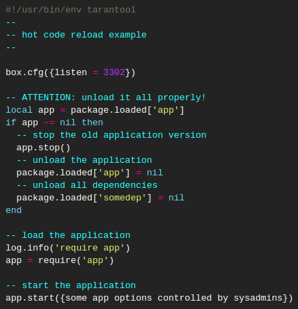
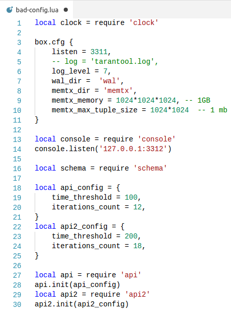
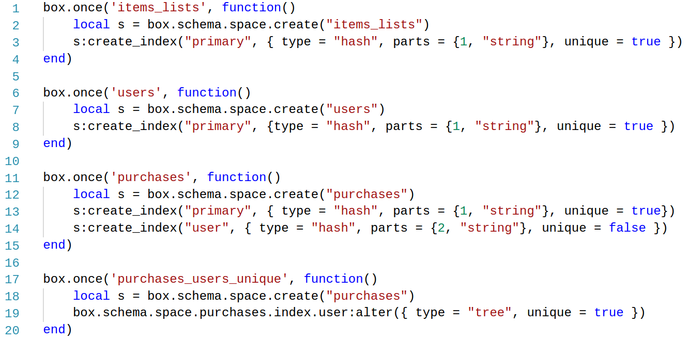
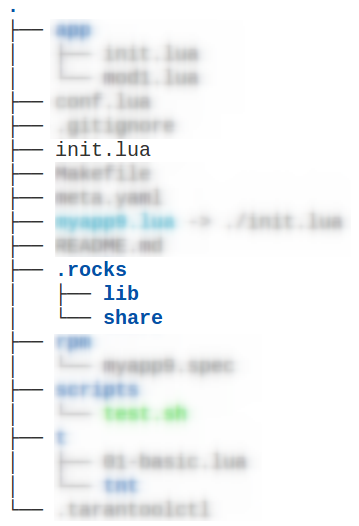
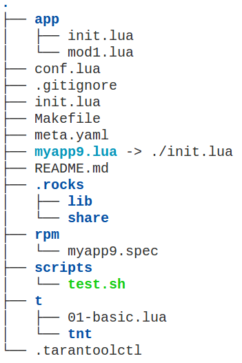

class:firstpage

# Создание production-ready приложения на Tarantool

### Игорь Латкин (KTS Studio)

---
layout: true
class: center, middle

---

.center.middle.img-width50[

]

---

layout: false

# Небольшая биография

--

<b>2015-2016</b> – Облако@Mail.Ru

--

<b>2016+</b> – KTS Studio

--

<br/>
Более <b>15</b> запущенных проектов на Tarantool

--

<b>EV::Tarantool16</b> – коннектор для 1.6+ для Perl

--

<b>asynctnt</b> – asyncio-коннектор для Python 3

--

<b>spacer</b> – модуль для управления спейсами в Tarantool

---
class: center, middle

# Типичные проблемы при создании приложения на Tarantool

---
class: center, middle

# Организация кода

.svg[

]

---

# Наивный подход

.svg[

]

--

## Это удобно, когда:

- хранимых процедур немного или их вовсе нет

--

- нет необходимости в разделении на модули

--

- нет внешних зависимостей

---

# Наивный подход

.svg[

]

## Минусы:

- конфигурация приложения рядом с кодом

--

- приложение нерасширяемо

--

- сложно поддерживать

---

# Модульный поход

.svg[

]

---
class: image-text

# Модульный поход

.svg[

]

.txt[

## Плюсы:

- Модульное разделение кода
]

--

.txt[
- Поддерживать проще
]

---
class: image-text

# Модульный поход

.svg[

]

.txt[

## Минусы:

- Конфигурация вместе с кодом
]

--

.txt[
- Зависимость от внешних модулей – через систему
]

---

# Reload приложения

.svg[

]

---

# Reload приложения

.svg.img-width90[

]

---

# Reload приложения

<br>
<br>
.center[
## Выгрузка загруженных модулей
]

--

<br>

.center[
## Накатывание нового кода в Tarantool
]

---

# Reload приложения (tarantool.org)

.center[

]

--

.right.meh1[

]

---

# Конфигурирование приложения

.svg.center[

]

---

# Конфигурирование приложения

<table width="100%" border="0">
    <tr>
        <td>
            <ul>
                <li><p class="h2">box.cfg{}</p></li>
                <li><p class="h2">Конфиг приложения</p></li>
            </ul>
        </td>
        <td>
            <div class="svg right">
                
            </div>
        </td>
    </tr>
</table>

---

# Конфигурирование приложения

<table width="100%" border="0">
    <tr>
        <td>
            <div class="center middle">
                <h2>Конфиг - это не часть<br>приложения</h2>
            </div>
        </td>
        <td>
            <div class="svg right">
                
            </div>
        </td>
    </tr>
</table>

---
class: split-60

# Конфигурирование приложения

.column2.right[

]

.column1[
## Конфиг должен быть:
- <p class="h2">Прост в чтении</p>
]

--

.column1[
- <p class="h2">Прост в редактировании</p>
]

--

.column1[
- <p class="h2">Прост в доставке на сервер (Ansible, Salt, Puppet, Chef, ...)</p>
]

---
class: split-60

.column2[
## Пример <br> "плохого конфига"
]

.column1[
.svg.img-width75[

]
]

---
# Управление спейсами

.img-width70.center[

]

--

.center[
<i>Разве тут что-то понятно?</i>
]

--

.center[
<br>
<b>Всегда используйте `:format()`</b>
]

---
# Внешние зависимости

.svg.img-width90[

]

---
class: middle, center

.img-width75[

]

---

# Внешние зависимости
<br>
.center[
## Самое простое решение – самое лучшее решение :)
]

<br>

.center.big.hljs[
<code>
package.path
<br>
package.cpath
</code>
]

---
# Как работает require в Lua?

--

## `require('module')`

`package.loaded['module']` ?

--

1. <b>`package.loaders[1]`</b> - ищет в package.preload

--

2. <b>`package.loaders[2]`</b> - ищет в package.path

--

3. <b>`package.loaders[3]`</b> - ищет в package.cpath

--

4. <b>`package.loaders[4]`</b> - C root


---

.left.img-height100[

]

.right[
# Внешние зависимости

.left[
```lua
addpaths('path', '.rocks/share/lua/5.1/?.lua',
                 '.rocks/share/lua/5.1/?/init.lua',
                 '.rocks/share/tarantool/?.lua',
                 '.rocks/share/tarantool/?/init.lua')

addpaths('cpath', '.rocks/lib/lua/5.1/?.so',
                  '.rocks/lib/lua/?.so',
                  '.rocks/lib64/lua/5.1/?.so',
                  '.rocks/lib/tarantool/?.so',
                  '.rocks/lib64/tarantool/?.so')
```
]
]

---

# rockspec sucks

--

```lua
package = 'queue'
version = 'scm-1'
source  = {
    url    = 'git://github.com/tarantool/queue.git',
    branch = 'master',
}
description = {
    summary  = "A set of persistent in-memory queues",
    homepage = 'https://github.com/tarantool/queue.git',
    license  = 'BSD',
}
dependencies = {
    'lua >= 5.1'
}
build = {
    type = 'builtin',

    modules = {
        --[[ ... ]]
        ['queue'] = 'queue/init.lua'
    }
}
```


---
# Внешние зависимости: dep

.h2[
- Попытка создать средство управления зависимостями
]

--

.h2[
- Под капотом – <b>luarocks</b> и <b>tarantoolctl rocks</b> .img-inline50px[]
]

--

.h2[
- Позволяет описывать зависимости от <u>rockspec</u>
]

---
# Внешние зависимости: meta.yaml

```yaml
name: trxdb
version: 0.1
deps:
  - "https://raw.githubusercontent.com/moonlibs/config/master/rockspecs/config-scm-2.rockspec"
  - "https://raw.githubusercontent.com/moonlibs/package-reload/master/package.reload-scm-1.rockspec"
  - "https://raw.githubusercontent.com/igorcoding/tarantool-spacer/master/rockspecs/spacer-scm-2.rockspec"
  - "https://raw.githubusercontent.com/moonlibs/obj/master/obj-scm-1.rockspec"
  - "https://raw.githubusercontent.com/Mons/lua-base58/master/lua-base58-scm-1.rockspec"
tntdeps:
  - "https://raw.githubusercontent.com/tarantool/vshard/master/vshard-scm-1.rockspec"
  - "https://raw.githubusercontent.com/tarantool/queue/master/rockspecs/queue-scm-1.rockspec"
  - "https://raw.githubusercontent.com/tarantool/pg/master/rockspecs/pg-scm-1.rockspec"
  - "https://raw.githubusercontent.com/tarantool/http/master/rockspecs/http-scm-1.rockspec"
localdeps:
  - "../ktslibs/rockspecs/ktslibs-scm-1.rockspec:../ktslibs"
  - "../prometheus/rockspecs/prometheus-scm-1.rockspec:../prometheus"
```

---
class: middle, center

# moonlibs/config

---
# moonlibs/config

```lua
box = {
    listen = 3311,
    log_level = 7,
    wal_dir =  'wal',
    memtx_dir = 'memtx',
    memtx_memory = 1024*1024*1024,
    memtx_max_tuple_size = 1024*1024
}

app = {
    api1 = {
        time_threshold = 100,
        iterations_count = 12,
    },
    api2 = {
        time_threshold = 200,
        iterations_count = 18,
    }
}
```

---
# moonlibs/config usage

```lua
local conf_path = os.getenv('CONF')
if conf_path == nil then
    conf_path = '/etc/myapp/conf.lua'
end

local conf = require('config')(conf_path)

local schema = require 'schema'

local api = require 'api'
api.init(conf.flat.app.api1)

local api2 = require 'api2'
api2.init(conf.flat.app.api2)
```

---

# moonlibs/config

.h2[
- Конфиг отдельно от приложения
]

--

.h2[
- Это любимый и родной Lua .img-inline50px[]
]

--

.h2[
- ```box.cfg{}``` на измененные параметры
]

--

.h2[
- etcd
]

---
class: middle, center

# moonlibs/package-reload

---

# Reload приложения (tarantool.org)

.center[

]

.right.meh1[

]

---

# moonlibs/package-reload

.big[
```lua
require 'package.reload'

local app = require 'app'
package.reload:register(app)

app.init({ ... })
```
]

---

# moonlibs/package-reload

<br>
<br>
.svg.img-width90.center[

]

---
# Управление спейсами

.img-width75.center[

]

---
class: center, middle, space

# igorcoding/tarantool-spacer

---

# igorcoding/tarantool-spacer

```lua
local spacer = require 'spacer'

spacer:space({
    name = 'purchases',
    format = {
        { name = 'id', type = 'string' },
        { name = 'user_id', type = 'string' },
        { name = 'item_id', type = 'string' }
    },
    indexes = {
        { name = 'primary', type = 'hash', unique = true, parts = { 'id' } },
        { name = 'user', type = 'tree', unique = false, parts = { 'user_id' } },
    }
})
```

--

.center.red[
## One single source of truth
]

---
# igorcoding/tarantool-spacer

- ### Автоматическое создание миграций для описанных спейсов

--

- ### Обнаружение изменений в формате, индексах

--

- ### Применение и откат миграций

--

- ### Упрощение работы с таплами спейсов

---
class: middle, center

# moonlibs/tarantoolapp

.svg[

]

---

# moonlibs/tarantoolapp

.h2[
- Шаблонизатор проектов
]

--

.h2[
- Отработанная структура проекта
]

--

.h2[
- Management пакетов
]

--

.h2[
- сonfig + package.reload
]

---
class: middle, center

# DEMO
---

.left.img-height100[

]

.right[
# moonlibs/tarantoolapp

.left[

Bootstrap проекта:

```
$ tarantoolapp create myapp
```

- <b>`myapp.lua`</b> - Точка входа в приложение
- <b>`meta.yaml`</b> - Описание зависимостей проекта
- <b>`conf.lua`</b> - Конфиг в формате <i>moonlibs/config</i>
- <b>`app`</b> - Приложение
<br>

Управление зависимостями:
```
$ tarantoolapp dep
```
]
]

---
class: center, middle

## Как начать пользоваться?

.big[
    <a href="https://github.com/moonlibs/tarantoolapp" target="_blank">github.com/moonlibs/tarantoolapp</a>
]


---

# Итоги

--

## Релоуд - [moonlibs/package-reload](https://github.com/moonlibs/package-reload)

--

## Конфиг - [moonlibs/config](https://github.com/moonlibs/config)

--

## Управление спейсами - [igorcoding/tarantool-spacer](https://github.com/igorcoding/tarantool-spacer)

--

## Шаблоны приложений & зависимости - [moonlibs/tarantoolapp](https://github.com/moonlibs/tarantoolapp)

---
class: center, middle

# Спасибо за внимание :)

---

.right[
## [tarantool.org](https://tarantool.org/doc)
]
.left[
## Documentation:
]
.clear[]
.right[
##[try.tarantool.org](https://tarantool.org/doc)
]
.left[
## Try it online:
]
.clear[]

.right[
##[github.com/tarantool](https://github.com/tarantool)
]
.left[
## Explore it:
]
.clear[]

.smallimg[

]

.lastquote[
### Questions?
]
